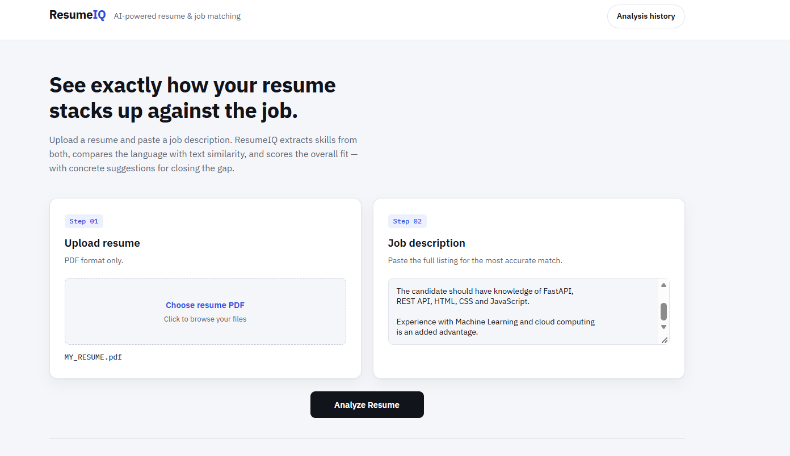
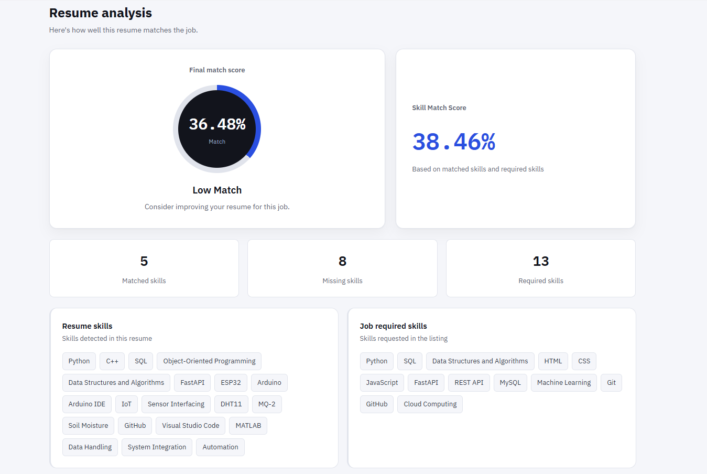
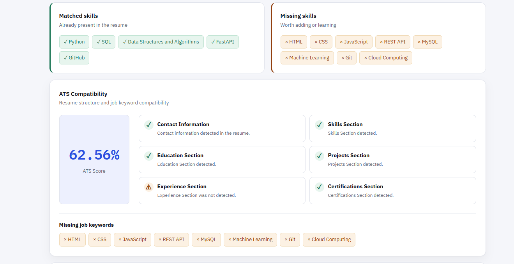
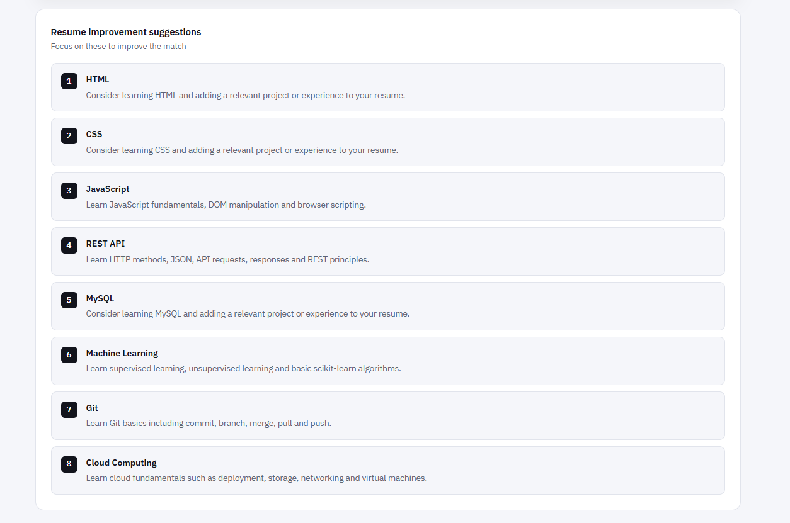
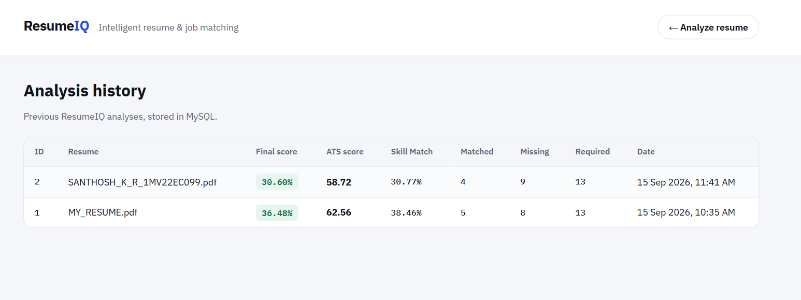

# ResumeIQ – Intelligent Resume Analysis & Job Matching System

ResumeIQ is an intelligent web-based resume analysis and job matching system that evaluates a candidate's resume against a given job description.

It extracts relevant skills, compares them with job requirements, calculates text similarity, generates an overall match score, evaluates ATS compatibility, identifies missing skills and keywords, and provides resume improvement suggestions.

---

## 🌐 Live Demo

Try ResumeIQ online:

https://resumeiq-97kt.onrender.com

## 🚀 Features

- 📄 Resume PDF Upload
- 🔍 Resume Text Extraction
- 🧠 Resume Skill Extraction
- 📋 Job Description Skill Extraction
- 🎯 Skill Matching & Skill Match Score
- 📊 Final Match Score
- 📈 Text Similarity Analysis
- 🤖 ATS Compatibility Score
- ✅ Matched Skills Detection
- ❌ Missing Skills Detection
- 🔑 Missing Job Keywords
- 💡 Resume Improvement Suggestions
- 🗄️ Analysis History
- 💾 MySQL Database Integration

---

## 🖥️ Screenshots

<table>
<tr>
<td width="50%">

### 🏠 Resume Analysis


</td>
<td width="50%">

### 📊 Analysis Results


</td>
</tr>

<tr>
<td width="50%">

### 🤖 ATS Compatibility


</td>
<td width="50%">

### 💡 Resume Improvement Suggestions


</td>
</tr>
</table>

### 🗄️ Analysis History



## 🛠️ Technologies Used

### Frontend

- HTML
- CSS
- JavaScript

### Backend

- Python
- FastAPI
- Uvicorn

### Resume Processing

- PyMuPDF

### Matching & NLP

- RapidFuzz
- Scikit-learn
- TF-IDF
- Cosine Similarity

### Database

- MySQL
- MySQL Connector/Python

### Development Tools

- Git
- GitHub

---

## 📁 Project Structure

```text
ResumeIQ/
├── screenshots/
│   ├── home.png
│   ├── results.png
│   ├── ats.png
│   ├── suggestions.png
│   └── history.png
│
├── app/
│   ├── __init__.py
│   ├── main.py
│   ├── database.py
│   ├── history.py
│   │
│   └── utils/
│       ├── matcher.py
│       └── resume_parser.py
│
├── static/
│   └── style.css
│
├── templates/
│   └── index.html
│
├── uploads/
│
├── test_matcher.py
├── test_parser.py
├── requirements.txt
├── .gitignore
├── .env
└── README.md
```

> **Note:** `.env` is used only for local configuration and should never be uploaded to GitHub.

---

## ⚙️ How It Works

```text
Resume PDF
    ↓
Text Extraction
    ↓
Resume Skill Extraction
    ↓
Job Description
    ↓
Job Skill Extraction
    ↓
Skill Matching
    ↓
TF-IDF + Cosine Similarity
    ↓
Final Match Score
    ↓
ATS Compatibility Analysis
    ↓
Missing Skills & Keywords
    ↓
Resume Improvement Suggestions
    ↓
Analysis History
```

---

## 📊 Matching Method

ResumeIQ calculates the **Final Match Score** using two components:

### 1. Skill Matching – 70%

The system compares skills extracted from the resume with skills required by the job description.

RapidFuzz is used for fuzzy skill matching.

### Skill Match Score

```text
Skill Match Score =
(Matched Skills / Required Skills) × 100
```

---

### 2. Text Similarity – 30%

Resume and job description text are converted into numerical representations using **TF-IDF**.

**Cosine Similarity** is then used to measure the similarity between the resume and job description.

---

### Final Match Score

```text
Final Match Score =
(70% × Skill Match Score) +
(30% × Text Similarity Score)
```

### Example

If:

```text
Skill Match Score = 50%
Text Similarity Score = 30%
```

Then:

```text
Final Match Score =
(0.70 × 50) + (0.30 × 30)

= 35 + 9

= 44%
```

The Final Match Score represents how well the candidate's resume matches the given job description based on the project's defined scoring method.

---

## 🤖 ATS Compatibility Score

ResumeIQ also calculates a **project-defined ATS Compatibility Score**.

The ATS analysis checks:

- Contact information
- Standard resume sections
- Job-related keywords
- Resume content
- Text quality
- Resume structure

The ATS score is separate from the Final Match Score and helps identify areas where the resume can be improved.

> **Important:** The ATS Compatibility Score is a score defined by this project for analysis purposes. It is not an official score from a commercial ATS platform.

---

## 💡 Resume Improvement Suggestions

ResumeIQ provides **rule-based suggestions** based on missing skills.

For example:

```text
Missing Skill: Docker

Suggestion:
Consider learning Docker and adding relevant
Docker-based projects or experience to your resume.
```

The suggestions are generated from the skills missing from the candidate's resume.

---

## 🗄️ Analysis History

ResumeIQ stores previous resume-job analysis summaries in MySQL.

The history includes:

- Resume filename
- Final Match Score
- ATS Score
- Skill Match Score
- Matched skill count
- Missing skill count
- Required skill count
- Analysis date and time

---

# 💻 Installation

## 1. Clone the Repository

```bash
git clone https://github.com/santhoshkr09062004/ResumeIQ.git
```

## 2. Navigate to the Project

```bash
cd ResumeIQ
```

## 3. Create Virtual Environment

```bash
python -m venv venv
```

## 4. Activate Virtual Environment

### Windows

```bash
venv\Scripts\activate
```

### Linux / macOS

```bash
source venv/bin/activate
```

## 5. Install Dependencies

```bash
pip install -r requirements.txt
```

---

# 🔐 Environment Variables

ResumeIQ uses environment variables to keep database credentials separate from the source code.

Create a file named:

```text
.env
```

in the **project root directory**, at the same level as `README.md`.

Example:

```env
DB_HOST=localhost
DB_USER=root
DB_PASSWORD=your_mysql_password
DB_NAME=resumeiq
DB_PORT=3306
```

Replace:

```text
your_mysql_password
```

with your own MySQL password.

### ⚠️ Security

Never upload `.env` to GitHub.

The project `.gitignore` already contains:

```text
.env
```

Therefore, Git will ignore the `.env` file.

Never hard-code your real database password inside:

```text
app/database.py
```

---

# 🗃️ Database Setup

ResumeIQ uses MySQL to store analysis history.

Create the database and table:

```sql
CREATE DATABASE IF NOT EXISTS resumeiq;

USE resumeiq;

CREATE TABLE IF NOT EXISTS analyses (
    id INT AUTO_INCREMENT PRIMARY KEY,
    filename VARCHAR(255),
    final_score DECIMAL(5,2),
    ats_score DECIMAL(5,2),
    text_similarity DECIMAL(5,2),
    matched_count INT,
    missing_count INT,
    required_count INT,
    created_at TIMESTAMP DEFAULT CURRENT_TIMESTAMP
);
```

The application reads the database configuration from the `.env` file.

---

# ▶️ Run the Application

Start the FastAPI server:

```bash
uvicorn app.main:app --reload
```

Open the application in your browser:

```text
http://127.0.0.1:8000
```

If port `8000` is already being used, you can use another port:

```bash
uvicorn app.main:app --port 8001
```

Then open:

```text
http://127.0.0.1:8001
```

---

# 🧪 Testing

The project includes test files for resume parsing and skill matching.

### Run the parser test

```bash
python test_parser.py
```

### Run the matcher test

```bash
python test_matcher.py
```

---

# 📌 Example Analysis Output

ResumeIQ can provide results such as:

```text
Final Match Score: 47.18%

ATS Compatibility Score: 70.26%

Skill Match Score: 53.85%

Matched Skills:
- Python
- SQL
- MySQL
- HTML
- CSS
- GitHub

Missing Skills:
- JavaScript
- FastAPI
- REST API
- Machine Learning
- Git
- Cloud Computing

Resume Improvement Suggestions:
- Add JavaScript experience to your resume.
- Add FastAPI and REST API experience if applicable.
- Highlight Git/GitHub usage.
- Include relevant Machine Learning or Cloud Computing experience if applicable.
```

The actual results depend on the resume and job description provided by the user.

---

# 🌐 Deployment

ResumeIQ is deployed as a web application using Render and Aiven Cloud MySQL.

The deployed application uses:

- Python
- FastAPI
- Uvicorn
- Render
- Aiven Cloud MySQL
- GitHub
- Environment Variables

### 🔄 Deployment Workflow

```text
GitHub
   ↓
Push changes to main
   ↓
Render Auto-Deploy
   ↓
Build Application
   ↓
Deploy ResumeIQ

```

### Build Command

```bash
pip install -r requirements.txt
```

### Start Command

```bash
uvicorn app.main:app --host 0.0.0.0 --port $PORT
```

> For cloud deployment, do not use `localhost` for the production MySQL database. Configure the application with the connection details of a cloud-accessible MySQL database using environment variables.

---

# 🔮 Future Enhancements

- 🤖 AI-powered resume recommendations
- 📄 DOCX resume support
- 💼 Job recommendation system
- 📝 Resume builder
- 🔐 User authentication
- 🗂️ Resume version management
- 🧠 Advanced NLP-based skill extraction
- 🌐 Job portal integration
- 🎯 Personalized career recommendations
- ☁️ Cloud-based resume storage

---

# 👨‍💻 Author

**Santhosh K R**

GitHub:

https://github.com/santhoshkr09062004/ResumeIQ

---

# 📄 License

This project is developed for educational and project demonstration purposes.